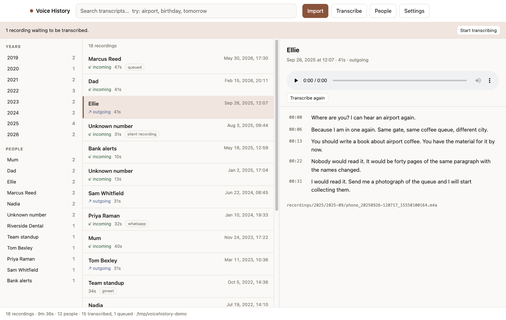
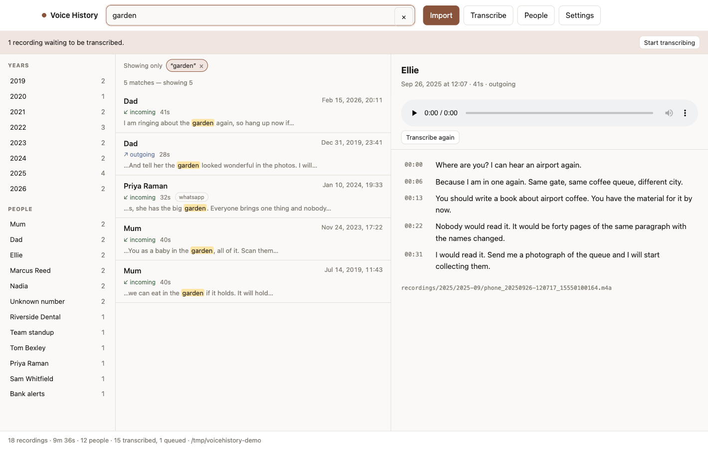
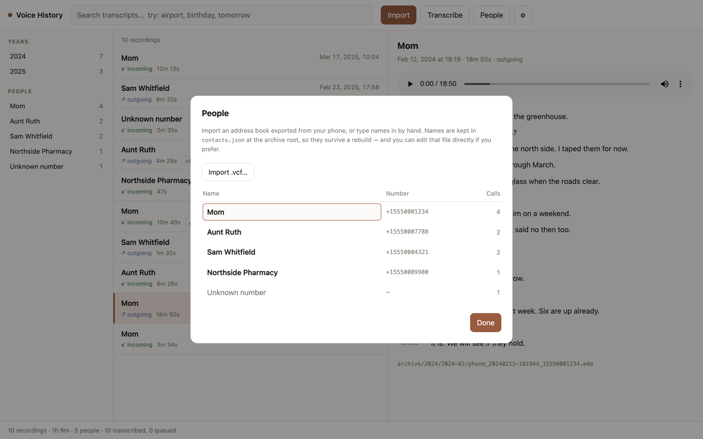
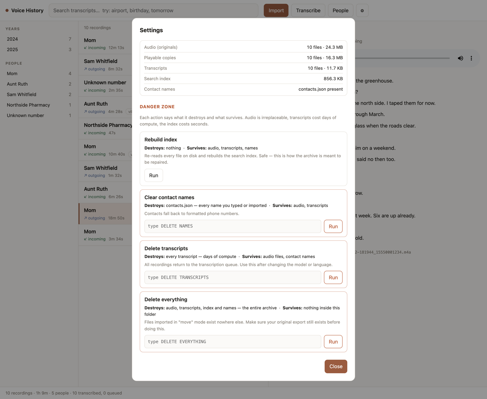

# Voice History

A local-first archive for recorded phone calls. Point it at a folder of
call-recorder exports and it files them by date, transcribes the speech, and
turns years of conversations into something you can search and listen back to.

Your archive is a folder of your own choosing — on this disk or an external one —
holding the recordings, transcripts and search index and nothing else. The app
keeps no copy: move the folder and the archive moves with it. Clone, run, point
it at your folder.

Nothing leaves your machine. No server, no account, no cloud service — the only
network access in the project is a one-time download of the speech model.

Built against a real archive: **5,372 recordings, 501 hours, 2019–2026**,
exported from [Cube ACR](https://cubeacr.app/) as 8 kHz AMR files.



<sub>Screenshots use sample data. The interface follows your system light/dark
setting — <a href="docs/01-archive-dark.png">dark version</a>.</sub>

## Quick start

```bash
git clone https://github.com/fedyunin/voicehistory.git
cd voicehistory

npm install
npm run setup      # checks ffmpeg + whisper.cpp, downloads the model (~1.5 GB)
npm start          # → http://127.0.0.1:4321
```

On first run the interface asks where to keep your archive. Nothing else needs
configuring.

Requires Node 20+, [ffmpeg](https://ffmpeg.org/) and
[whisper.cpp](https://github.com/ggml-org/whisper.cpp). On macOS:
`brew install ffmpeg whisper-cpp`. Run `npm run doctor` to see what is missing.

## Using it

Everything happens through three buttons.

**Import** — takes a folder of recordings. Drop files into the archive's
`inbox/`, or paste the path to a phone export. Recordings are filed into
`recordings/YEAR/YEAR-MONTH/`, get a browser-playable copy, and appear in the
list within minutes.

**Transcribe** — drains a queue held in the database. Stop and resume any time;
transcripts appear as they land. Follow progress in the browser, or from a
terminal with `npm run watch`.

**People** — imports a `.vcf` address book from your phone, or lets you type
names in. Numbers are normalized so the same person written two different ways
becomes one contact.

Then: browse by year or person, search across every transcript, and click any
line of a transcript to jump to that moment in the audio.

| Full-text search across every transcript | Naming the people behind the numbers |
|---|---|
|  |  |

## How it works

Your archive — anywhere you like, nothing of the app inside it:

```
<your archive folder>/
  archive.json             manifest: format version + settings for this data
  recordings/2026/2026-07/  originals, filed by month (+ .props sidecars)
  audio/2026/2026-07/       playable copies — no browser can play AMR
  transcripts/2026/2026-07/ raw model output, as JSON
  contacts.json             names you assigned
  index.sqlite              search index (SQLite + FTS5) — derived
  inbox/                    drop new recordings here
```

The checkout — no user data inside it:

```
core/                      all logic, with no knowledge of any interface
cli/                       CLI and HTTP server — thin adapters over core/
app/renderer/              the UI: vanilla HTML/JS, no build step
```

Which archive is open is remembered per machine, in the OS config location
(`~/Library/Application Support/voicehistory` on macOS). Everything describing
the DATA — language, numbering plan, model — lives in `archive.json` instead, so
it travels with the recordings. `archive.json` carries a **format version**, so a
later version of the app can tell what it is reading, and refuses an archive
newer than it understands rather than corrupting it.

Three rules hold the design together:

**Files are the source of truth; the database is derived.** SQLite holds nothing
that `recordings/` and `transcripts/` do not. `npm run reindex` rebuilds it from
scratch, so schema changes need no migrations and an indexing bug cannot cost
you data.

**A recording's identity is its SHA-256**, not its filename. Re-importing the
same export is a no-op, which matters because in practice you re-export the
whole recorder folder every time. Nothing is ever deleted — duplicates are
parked in `inbox/_duplicates/` for you to review.

**Raw model output is kept.** Filtering happens at index time, so improving it
costs one `reindex` instead of re-transcribing days of audio.

## Configuration

Settings are edited in **Settings → Language and region** in the interface. They
are stored in `archive.json` inside the archive, so they travel with the data:

```json
{
  "formatVersion": 1,
  "settings": {
    "language": "en",
    "model": "large-v3-turbo",
    "prompt": null,
    "silencePeakDb": -60,
    "numbering": { "countryCode": "1", "trunkPrefix": "", "nsnLength": 10 }
  }
}
```

Editing that file by hand works too. Nothing about the language or the phone numbering plan is
hardcoded; the defaults simply match the archive this was built against
(Russian, country code 7). `prompt` is the priming text that makes the
recognizer produce punctuation at all — it **must** be written in the language
you are transcribing, and `null` selects a built-in sample.

For a one-off run, an environment variable overrides the file:

```bash
VH_LANGUAGE=en npm run transcribe
```

`VH_LANGUAGE`, `VH_MODEL`, `VH_PROMPT`, `VH_SILENCE_PEAK_DB`,
`VH_COUNTRY_CODE`, `VH_TRUNK_PREFIX`, `VH_NSN_LENGTH`. `VH_ROOT` opens a
specific archive for one command — useful for scripts, and the only setting that
cannot live in the archive, since a file inside it cannot say where it is.

Fields whose value is currently coming from an environment variable are shown
disabled in the interface, rather than letting you save a value that would
appear to do nothing.

Settings shows every value in effect and whether it came from the file, the
environment or a default.

## Commands

```bash
npm start          open the archive in a browser
npm run setup      verify tools, fetch the model
npm run doctor     environment check
npm run status     summary: years, people, hours
npm run watch      follow a job running elsewhere
npm run jobs       history of past runs
npm run reindex    rebuild the database from files

node cli/vh.js archive               show the current archive and recent ones
node cli/vh.js archive /path/to/dir  open or create an archive there
```

The CLI has a little more: `node cli/vh.js` prints everything, including
importing without moving the sources and transcribing a limited batch.

## Notes on the hard parts

Most of the interesting decisions here came out of measurement rather than
theory — why the recognizer needs a priming prompt to produce punctuation at
all, why silent recordings have to be detected before transcription, why audio
normalization helps but volume does not, and why a single-writer lock turned out
to be load-bearing.

**→ [docs/ENGINEERING.md](docs/ENGINEERING.md)**

## Backups and maintenance

Back up the archive folder — or just `recordings/`, `transcripts/` and
`contacts.json` from it. Everything else in there is reproducible — playable copies by re-encoding, the index with `reindex`. The
transcripts are worth keeping precisely because they represent days of compute.

Settings shows what is on disk and what each destructive action would cost.
Anything irreversible states what it destroys and what survives, and needs a
phrase typed to confirm.



## Privacy and legality

Call recordings are sensitive, and in many places recording a call requires the
consent of both parties. This tool is for organizing recordings you already have
and are entitled to keep: it runs entirely locally, transmits nothing, and the
archive lives outside the checkout entirely, so it cannot be committed by
accident.

## License

MIT
